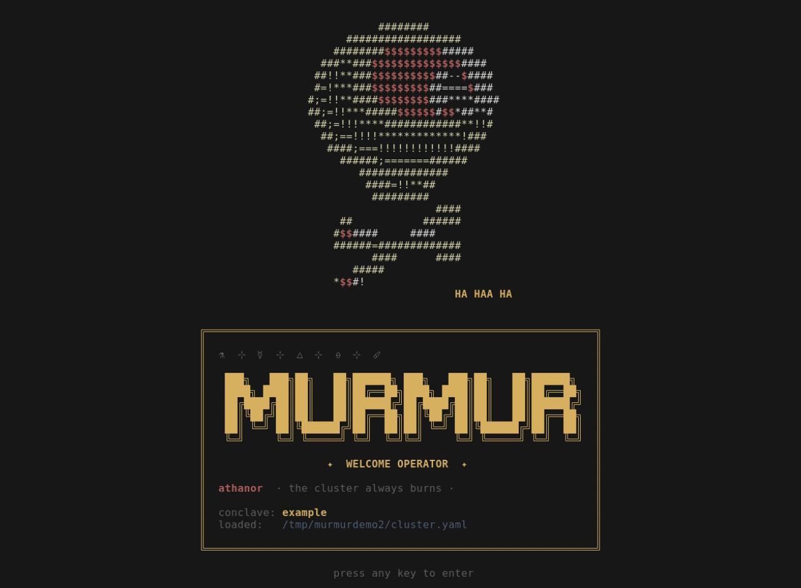

<p align="center">
  
</p>

<h1 align="center">murmur</h1>

<p align="center">Manage a ProxMox cluster from one config file — CLI + TUI.</p>

<p align="center"><i>Early but usable. The config schema may still change between releases.</i></p>

---

## Quickstart

```bash
# build
go build -o murmur ./cmd/murmur

# configure — copy, then edit with your cluster's values
cp configs/example.yaml        cluster.yaml    # nodes, storage, network
cp configs/cluster.env.example cluster.env     # secrets (gitignored)

# run
./murmur validate   # check the config — no cluster needed
./murmur tui        # launch the UI
```

murmur reads `./cluster.yaml`, then `~/.config/murmur/cluster.yaml` (override with `--config`). `cluster.env` lives next to it.

## Why

Managing a ProxMox cluster usually means clicking through the web UI one node at a time, or gluing together bash, Terraform, and Ansible. murmur does it from one place: describe the cluster once in YAML, then deploy, tear down, patch, and upgrade guests across every node from a CLI and TUI.

- **Native ProxMox API** — no Terraform/OpenTofu.
- **Built-in SSH** for post-deploy steps — no Ansible (call a playbook if you want one).
- **Real multi-operator access** — scoped roles backed by actual ProxMox ACLs, not just hidden UI buttons.

## Features

- **Declarative app catalog.** Define apps in `cluster.yaml`; deploy each as a
  VM or a lightweight LXC. One picker, confirm, go.
- **One-key lifecycle.** Separate TUI tabs for deploy, teardown, patch, and
  host upgrades — each backed by a single orchestrator entrypoint.
- **HA-aware teardown.** Removes a guest from HA before destroy, tolerates the
  pvestatd status cache lag, and polls through LXC cleanup.
- **Update detection.** An image-digest probe compares each guest's local
  RepoDigest against the registry and shows `UPDATES:n/total` in the patch tab.
- **Multi-user operators.** Named operators with role-scoped tabs/apps, backed
  by per-operator ProxMox tokens + pool/ACL bundles. Murmur is the ergonomic
  layer; ProxMox ACLs are the actual perimeter.
- **Turnkey operator kits.** Adding an operator exports a ready-to-run zip
  (binary + config + a standalone `cluster.env` + README) to hand off.
- **Secrets prompted at deploy.** Per-replica secrets are collected at deploy
  time, exported to post-deploy steps, and never logged.
- **Reverse-proxy hints.** Optionally stamp a route string on the guest's PVE
  description for an external sync (Traefik scraper, Caddy, …) to publish.
- **Event-driven TUI, no periodic refresh.** Redraws fire on user input or
  async-fetch-complete messages — never on a tick — so copy-paste just works.

## Configuration

The cluster config is the contract. See
[`configs/example.yaml`](configs/example.yaml) for the full schema with inline
docs.

Required sections:

- `cluster.api` — endpoint, token ID, token secret, TLS verify flag
- `cluster.nodes` — name + address + roles for each node
- `cluster.storage` — ProxMox storage IDs for VM disks, shared content, ISOs
- `cluster.network` — default bridge, optional default VLAN
- `cluster.ssh` — cloud-init default usernames per distro, identity path

Optional sections: `users`, `roles`, `flavors`, `images`, `apps`,
`reverse_proxy`, `monitoring`, `storage_backends`.

Secrets use `${VAR}` references resolved from a sidecar `cluster.env` file or
process env. Missing variables fail loudly with the field path that needed them.

### Two-file pattern

| File | Committable? | Contents |
|---|---|---|
| `cluster.yaml` | yes | the schema above, with `${VAR}` for anything secret |
| `cluster.env`  | no (gitignored) | `KEY=value` pairs, loaded before the YAML is parsed |

This keeps `cluster.yaml` identical across operators — only each operator's
`cluster.env` differs.

## Commands

| Command | What it does |
|---|---|
| `murmur validate` | Load + validate the cluster config. No network. |
| `murmur status` | Connect, print PVE version, resource tally by type, verify configured storage IDs exist. |
| `murmur whoami` | Print the resolved operator identity + role for this invocation. No network. |
| `murmur tui` | Launch the interactive TUI. |

Global flags: `--config PATH` (override config discovery), `--as NAME` (select
an operator from `users:`; or set `MURMUR_USER`).

### TUI

Tabs: **overview**, **apps**, **deploy**, **teardown**, **update**, **patch**,
and **users** (admin-only). Which tabs an operator sees is gated by their role.

Global keys: `r` refresh, `?` toggle help, `q` quit.

## Repo layout

```
cmd/murmur/         CLI entry point
internal/config/    Cluster config types, loader, validator, builtin catalogs
internal/proxmox/   ProxMox API client (typed, context-aware)
internal/provision/ App lifecycle orchestrator (deploy/teardown/upgrade/patch)
internal/tui/       Bubble Tea app, views, styles
configs/            example.yaml + cluster.env.example
```

Built on the [Charm](https://charm.sh) stack —
[Bubble Tea](https://github.com/charmbracelet/bubbletea),
[Lip Gloss](https://github.com/charmbracelet/lipgloss),
[Bubbles](https://github.com/charmbracelet/bubbles).

## Go version

1.25.5.

## License

[AGPL-3.0](LICENSE). The copyleft is intentional: improvements to murmur,
including those run as a network service, stay open.
